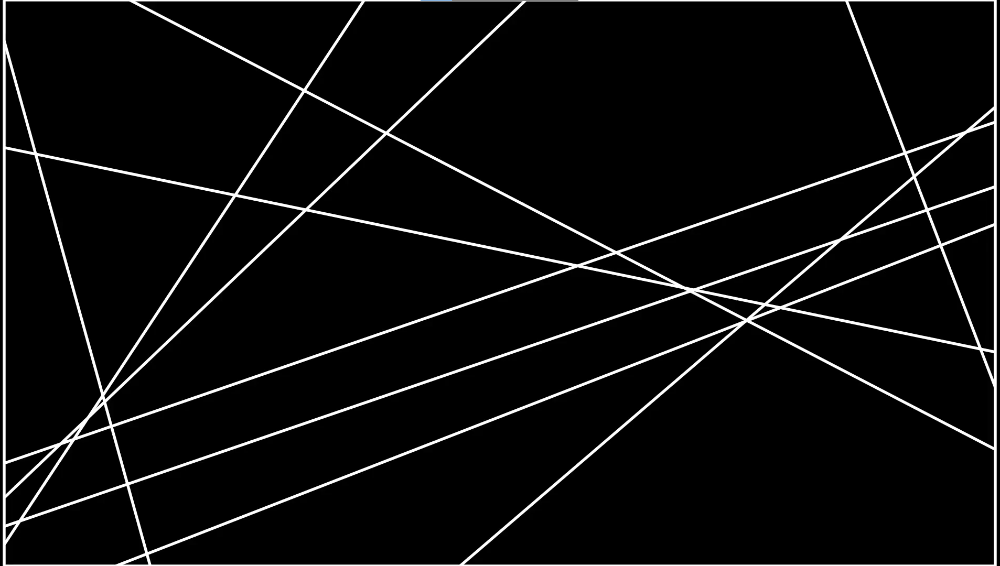
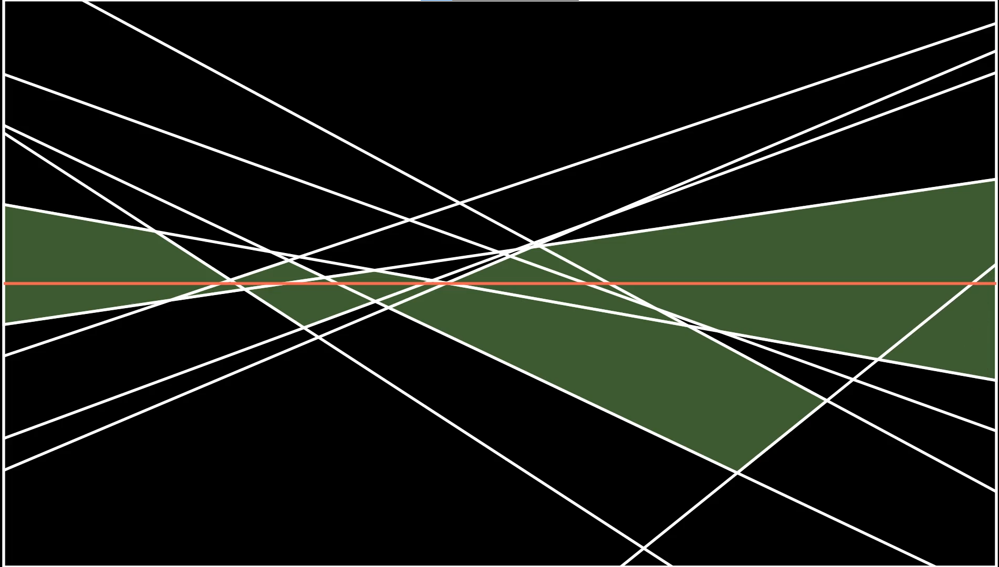

# Zone Theorem

## Introduction

An arrangement of lines is the polygonal subdivision induced by those lines in the plane.



The zone of a line is all polygons in an arrangement of lines that a line crosses.



The Zone theorem states that assuming general position for the lines (no 2 lines parallel, no 3 lines intersecting at a point), the number of edges in the zone of any line is O(n), where n is the number of lines in the arrangment.
This result has implies that one can incrementally build a polygonal subdivision data structure for an arrangment in O(n<sup>2</sup>) time.
This repository is meant to create a visual proof of the zone theorem on randomized arrangments using real data structures.

## Static Walkthrough

### Dependencies

-   Python >= 3.7
-   [Manim Community Edition](https://github.com/ManimCommunity/manim) and realted dependencies
-   A LaTeX engine like TeXLive or MiKTex
-   [NumPy](https://numpy.org/)
-   [Sphinx](https://www.sphinx-doc.org/en/master/) with Read The Docs theme (for generating documentation)

### Build Video

Once you have all the necessary dependencies installed, you can render the entire video using the following command from the project root directory:

```bash
python -m manim prove.py
```

This will create a video in `[PROJECT ROOT]/media/vidoes/prove/1080p60/Main.mp4`.
You can use flags described in the manim documentation like `-p` or `-ql` to automatically play the video when done rendering or adjust the video quality.

### Build Documentation

To generate the documentation run the following command from the `docs` folder

```bash
make html
```

This will generate several html files in `[PROJECT ROOT]/docs/_build/html`. `index.html` is the home page of the documentation.

### Runs Tests

To run the tests run the following command from the project root directory

```bash
python tests
```

## Group Members

-   Drew Hughlett
-   William Boyles
-   Scott Joyner
